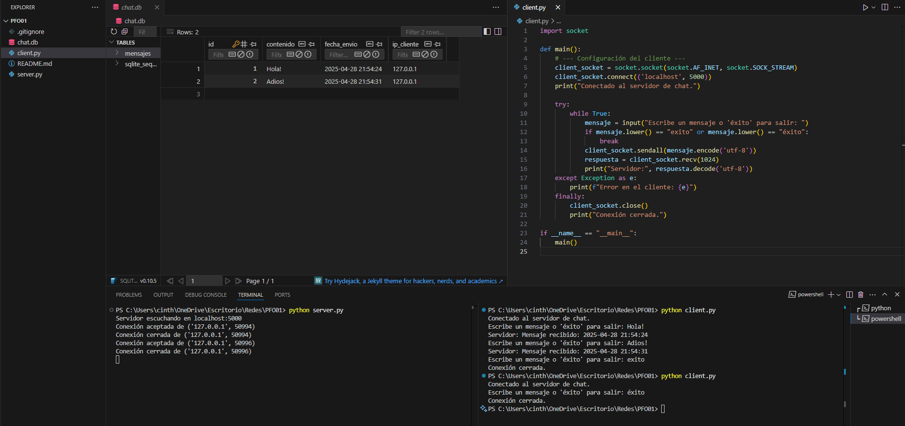

# Chat Básico Cliente-Servidor con Sockets y SQLite

Este proyecto implementa un servidor y cliente de chat usando **sockets TCP/IP** en Python, cumpliendo con las buenas prácticas de modularización, manejo de errores y persistencia en base de datos.

## Estructura
- `server.py`: Inicializa el socket servidor, recibe mensajes de clientes, guarda los mensajes en SQLite y responde con un timestamp.
- `client.py`: Permite al usuario enviar mensajes al servidor hasta escribir `éxito` o `exito`.

## Instrucciones

1. Clonar el repositorio:
   ```bash
   git clone https://github.com/VCinthia/TSDS.Redes.PFO01.git
   ```

2. Ejecutar el servidor:
   ```bash
   python server.py
   ```

3. En otra terminal, ejecutar el cliente:
   ```bash
   python client.py
   ```

4. Escribir mensajes en el cliente. Para terminar, escribir `éxito` o `exito`.

## Notas
- El servidor crea automáticamente una base de datos `chat.db` si no existe.
- Cada mensaje guardado incluye: contenido, fecha y hora de envío, IP del cliente.

## Captura
